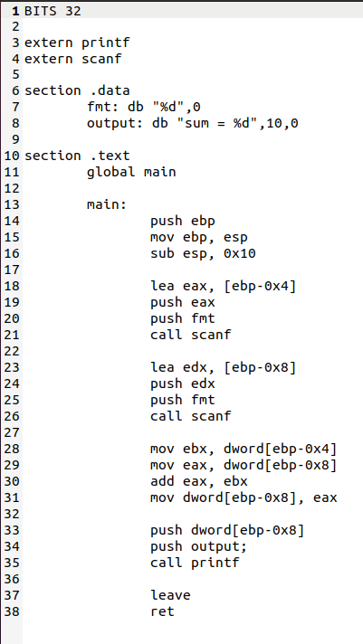

#Assembly challenge
\
So at first we set the bits as 32. Then we include the libraries of print and scan. In data we store the format of the inputs and the outputs to be given.
In the main section first we  set the function prologue the we use lea to move the value of ebp-0x4 to eax, we push eax the variable and we push the format specifier. then we call scanf function and this is done again to input value to the next variable. In the next line we move the values into a register and then they are added and they are moved into a register.\
Then we give the value and in the next line we specify the format and then print function is called and the sum is outputted. We return the prg in the next line.