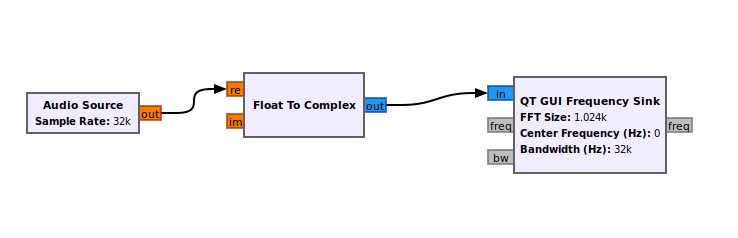
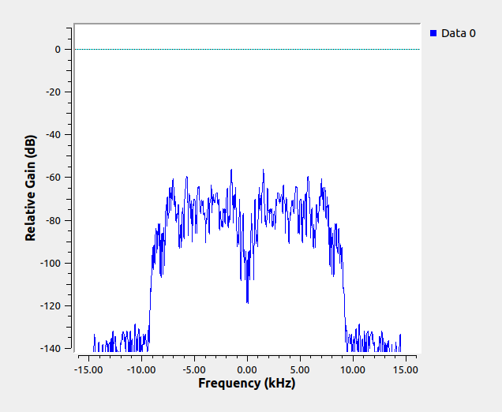

#Challenge 1
##Q. Make a GNURadio flowgraph that takes an audio input from your sound card and maps its frequency domain representation.
Here we have used an **audio source** to take input from the microphone. Then we use a **float to complex** which is a datatype converter to convert it to complex signal and then we send the signal to **QT GUI frequency sink** which is ued to display the signal in the frequency domain representation

