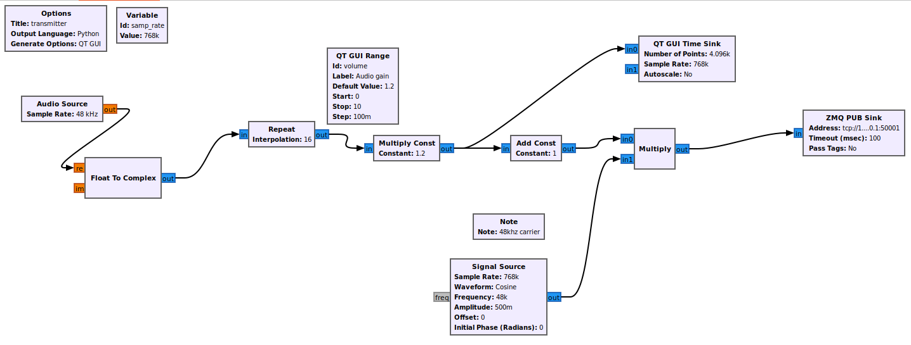
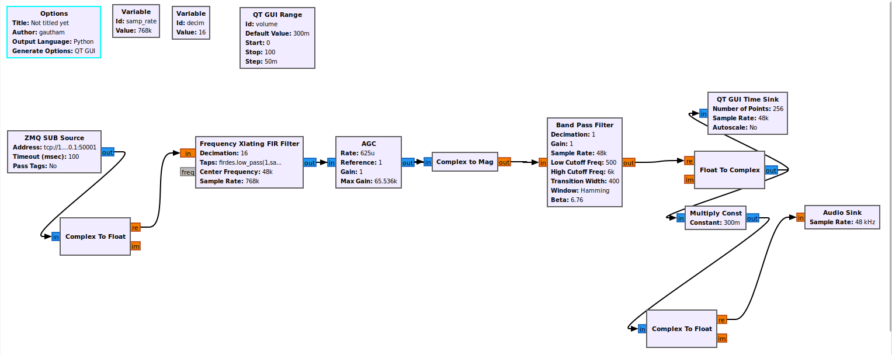
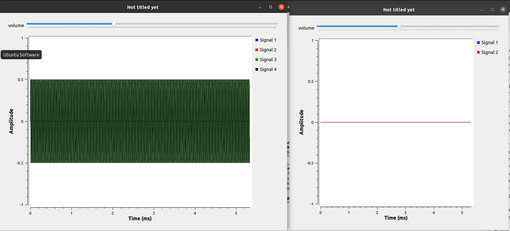

#Challenge 2
##Make 2 GNU Radio flowgraphs implementing an AM Receiver and Transmitter and test its working
###Transmitter

###Receiver

###Working
We run the 2 files using cmd. Whenever we speak through the microphone i.e the audio source causes a change in pattern in the GUI sinks. We can also receive the audio through the receiver through the audio sink through the speaker.
